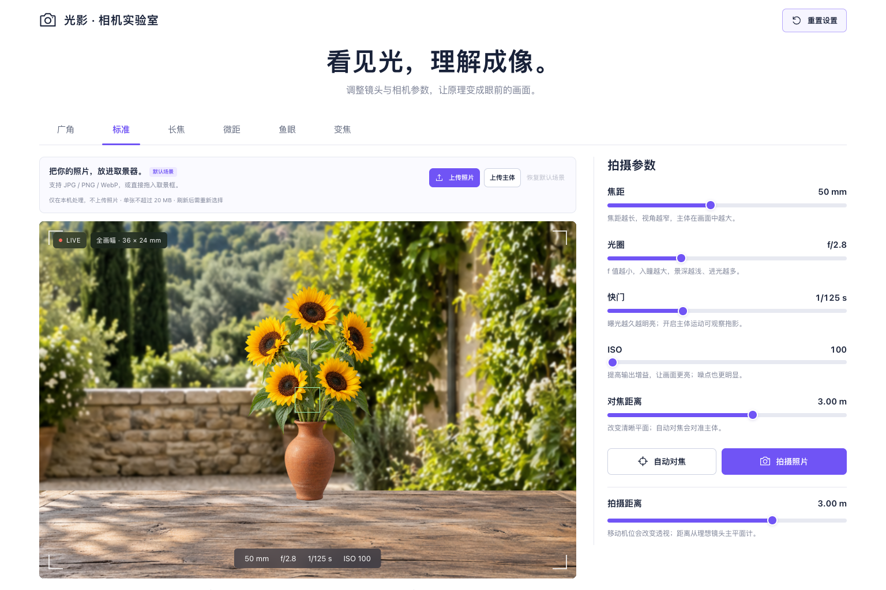

# 光影 · 相机成像实验室

用 HTML、CSS 和 JavaScript 实现的交互式相机成像模拟器。使用默认场景或自己的照片，调节镜头与曝光参数，实时观察取景、景深、虚化、噪点和运动拖影，并了解不同相机镜头的成像原理。



## 直接运行

下载或克隆仓库后，用 Chrome、Edge 或 Safari 打开根目录的 **`camera-simulator.html`**。

成品 HTML 已内嵌脚本、样式和图片，可以离线运行，无需安装依赖或启动服务器。

```bash
git clone https://github.com/thomasDJMax/wcd.git
cd wcd
```

如需通过本地服务器访问，也可在仓库目录执行：

```bash
python3 -m http.server 8000
```

然后打开 <http://localhost:8000/camera-simulator.html>。

## 可以做什么

- 切换广角、标准、长焦、微距、鱼眼与变焦镜头，查看各类镜头的说明和成像示意。
- 调节焦距、光圈、快门、ISO、对焦距离和拍摄距离，观察参数如何影响画面。
- 点击主体或背景对焦，使用自动对焦、构图网格和参数复位。
- 上传自己的照片，或将 JPG、PNG、WebP 拖入取景框，选择铺满画面或完整显示。
- 上传独立主体素材，调节主体大小、横纵位置和背景间距，比较不同距离的离焦效果。
- 开启主体运动，对比快快门与慢快门产生的拖影。
- 在微距模式体验理想薄透镜的 1∶1 成像。
- 拍摄当前模拟画面并保存为 PNG。
- 在桌面与手机浏览器中使用响应式界面。

## 使用自己的照片

点击“上传照片”，或将 JPG、PNG、WebP 文件拖入取景框。照片会替换默认场景中的花瓶，作为一张平面进行成像模拟；取景器比例为 3∶2，可选择“铺满画面”或“完整显示”。画面大小以标准镜头 50 mm、拍摄距离 3 m 为参考，之后仍可调节镜头、光圈、曝光和对焦等参数。

点击“上传主体”可进入分层模式，将主体作为独立图层叠加到背景上。推荐使用带透明通道的 PNG 或 WebP；不透明图片会以矩形叠加。主体大小范围为 25%–200%，横纵位置均可在 ±40% 范围内调整，背景间距可设为 0.5–15 m。点击主体或背景可分别对焦，开启主体运动可观察拖影。

单个文件最大 20 MB。读取后会保持比例缩小至最长边不超过 2400 像素、总像素不超过 400 万。图片只在浏览器本机处理，不会上传到服务器；刷新页面后需重新选择。重置相机设置会保留自定义素材，点击“恢复默认场景”才会移除它们。

整张照片模式使用统一离焦，不识别照片中的真实深度，也不能还原原图中已经模糊的细节。需要分别模拟主体和背景的清晰程度时，请使用分层模式。详细步骤见 [使用说明](docs/使用说明.md)。

## 修改与构建

编辑 `src/camera-template.html`，或替换 `assets/` 中的 PNG 素材，然后运行：

```bash
python3 build.py
```

构建脚本仅使用 Python 标准库，将素材嵌入根目录的 `camera-simulator.html`。构建后重新打开或刷新该 HTML 即可。

```text
.
├── camera-simulator.html       # 可直接运行的离线成品
├── build.py                    # 标准库构建脚本
├── src/
│   └── camera-template.html    # 页面、样式与模拟逻辑
├── assets/
│   ├── background.png         # 花园背景
│   └── subject.png            # 带透明通道的花瓶主体
└── docs/
    ├── 使用说明.md             # 操作、公式与模型说明
    └── camera-preview.png      # 界面预览
```

## 成像模型

模拟器采用 36×24 mm 全画幅传感器、理想薄透镜，以及单平面照片或分层场景。薄透镜公式、投影倍率、弥散圆与景深计算相互对应；微距包含理想延伸曝光损失。鱼眼采用等距映射，曝光、虚化、ISO 噪点与运动模糊使用教学近似。

这是一款帮助理解相机参数的教学模拟器。模型未包含具体镜头的真实镜组、衍射、像差、内对焦结构及传感器标定。固定机位变焦主要改变取景范围；透视关系由拍摄位置决定。

完整操作与模型范围见 [使用说明](docs/使用说明.md)。默认场景素材由 AI 生成，并已包含在仓库内。

## 自定义照片功能验证

自定义照片功能通过 26 项浏览器检查。使用已有 Chrome 与 Playwright 验证桌面 1536×1024 和手机 390×844，以及直接打开离线 HTML 的流程。

检查包括 JPG/PNG/WebP 导入、透明与不透明主体、铺满/完整显示、对焦、焦距和曝光、主体大小和位置、背景间距、六种镜头、微距 1∶1、运动拖影、连续换图、导入期间恢复默认、损坏/超大/错误格式文件、拖入图片、JPEG 方向信息，以及实际 PNG 下载。手机没有横向溢出；控制台没有错误或警告；没有照片上传网络请求。

## 原版功能验证记录

以下为加入自定义照片功能之前的验证记录：六类镜头、参数调节、对焦、网格、主体运动、微距 1∶1、复位和拍照预览均已进行浏览器交互验证。桌面 1536×1024、手机 390×844 已检查布局；JavaScript 语法检查通过。该记录不代表新增上传、图片适配和分层编辑功能已完成验证。

数值示例：50 mm、f/2.8、对焦 3 m 时，景深约为 2.73–3.33 m；ISO 翻倍增加一档亮度，快门时间减半减少一档亮度，f/2.8 改为 f/5.6 减少两档亮度。

## 参考

- [尼康：理解焦距](https://www.nikonusa.com/learn-and-explore/c/tips-and-techniques/understanding-focal-length)
- [斯坦福：高斯成像](https://www-graphics.stanford.edu/courses/cs178-11/applets/gaussian.html)
- [斯坦福：景深演示](https://www.graphics.stanford.edu/courses/cs178/applets/dof.html)
